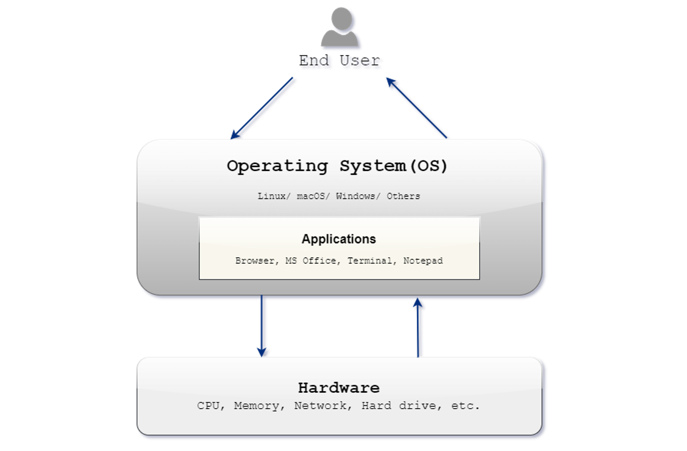

#   [Operating System Overview](https://cloudyuga.guru/courses/mastering-linux/)

##  Overview
An <b>Operating system (OS)</b> is essential software that manages computer hardware and provides user interfaces. It acts as an intermediary between applications and hardware, overseeing processes, memory, file systems, and devices. OSs offer various interfaces, such as command-line and graphical, and ensure security and resource optimization. Popular examples include Windows, macOS, and Linux for computers and iOS and Android for mobile devices.

##  Objectives
By the end of this module I will be able to do the following:

+   Differentiate among the various operating systems available in the market
+   Grasp the multiple methods for accessing and utilizing an operating system
+   Recognize the distinctions between an operating system on a bare metal machine, containers, or a virtual machine

##  Operating System and its functions

An <b>Operating System (OS)</b> is a system software that helps in operating <b>hardware</b> and <b>software</b> of the computer and also manages all other application programs in a computer. It acts as an interface between computer hardware components and the user.

    

<small><strong><i>Operating System Overview</i></strong></small>

### Functions of an Operating System (OS)
####    1.  Process Management
####    2.  Memory Management
####    3.  File Management
####    4.  Device Management
####    5.  Security
####    6.  Monitoring and Error Detection
####    7.  Coordination Management
####    8.  Job Scheduling and Accounting

### Types of OS
####    1.  Linux OS
####    2.  Mac OS
####    3.  Windows OS
